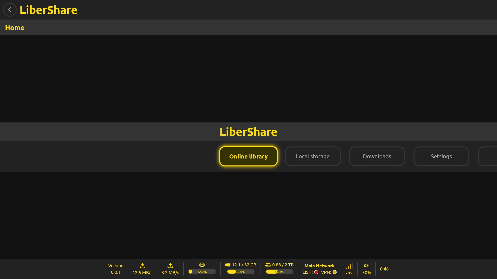
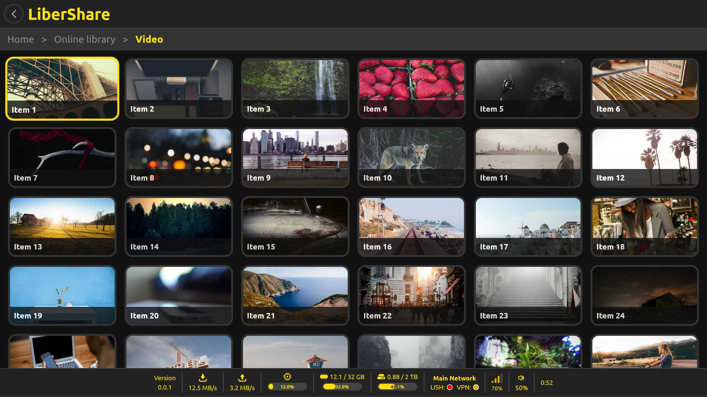
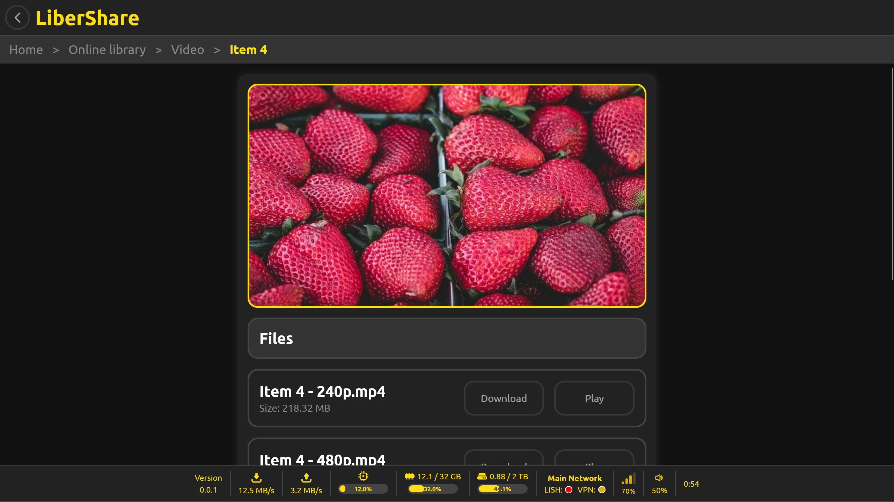

# LiberShare

## Table of contents

- [**About**](#about)
- [**Key features**](#key-features)
- [**Screenshots**](#screenshots)
- [**Documentation**](#documentation)
- [**Installation**](#installation)
- [**License**](#license)
- [**Contribution**](#contribution)
- [**Donations**](#donations)
- [**Star history**](#star-history)

## About

Official website: **https://libershare.com**

**LiberShare** is a peer-to-peer file sharing software built on modern decentralized technologies. It represents the **next generation of file sharing**. It combines a modern, intuitive user interface with a fully decentralized architecture, offering users a secure and easy-to-use solution for sharing data without relying on any central authority.

## Key features

**LiberShare** offers a combination of unique features that set it apart from other technologies available today. It introduces its own [**LISH network protocol**](./LISH_NETWORK_PROTOCOL.md) and [**LISH data format**](./LISH_DATA_FORMAT.md) for efficient and secure content distribution.

### Fully decentralized network

No central servers, no single point of failure.

- Each network maintains its own decentralized database of shared content. Users automatically update and store the latest version of it and replicate it among themselves. Browse and discover the content within your network without relying on centralized indexers or trackers.

- Everyone with a public IP address can start their own relay node connected to a network to ensure connectivity for users behind strict NATs and firewalls. This ensures that data is always maximally accessible to users.

### Fine-grained access control

- Everyone is free to start their own network with its own rules.

- Define user roles within each network: owners, admins, publishers, moderators and downloaders. Control exactly who can publish, moderate and download content.

### Top-notch user interface

- **A stunning media center user interface** designed for **desktop, TV and mobile** platforms. Navigate seamlessly with keyboard, mouse, gamepad, or remote control.

- Power users can leverage **a command line interface** for running the software as a headless file server.

### Human-readable data format

- The [**LISH data format**](./LISH_DATA_FORMAT.md) is based on [**JSON**](https://en.wikipedia.org/wiki/JSON), making it easy to create, read and understand. Share your content with clear, transparent metadata that anyone can easily inspect.

### Privacy and security

- Encrypted data transfer - all peer-to-peer communication is encrypted, ensuring your data remains private during transfer.

- Users can hide behind a VPN for an additional layer of anonymity. **LiberShare** respects your privacy by design.

### Cross-platform availability

- **LiberShare** is available for Windows, Linux, macOS, Android, Android TV and iOS.

## Screenshots

## Documentation

- [**LISH data format**](./LISH_DATA_FORMAT.md) - Specification of the data structure format for files and directories
- [**LISH network format**](./LISH_NETWORK_FORMAT.md) - Specification of the network structure format
- [**LISH network protocol**](./LISH_NETWORK_PROTOCOL.md) - Specification of the peer-to-peer communication protocol

## Installation

- For installation instructions follow [**this document**](./INSTALL.md).

## License

- This software is developed under the license called [**Unlicense**](./LICENSE).

## Contribution

If you are interested in contributing to the development of this project, we would love to hear from you! Developers can reach out to us through one of the contact methods listed on [**our contacts page**](https://libersoft.org/contacts). We prefer communication through our Telegram chat group, but feel free to use any method that suits you.
In addition to direct communication, you are welcome to contribute by submitting issues or pull requests on our project repository. Your insights and contributions are valuable to us. We look forward to collaborating with you!

## Donations

Donations are important to support the ongoing development and maintenance of our open source projects. Your contributions help us cover costs and support our team in improving our software. We appreciate any support you can offer.

To find out how to donate our projects, please navigate here:

Thank you for being a part of our projects' success!

## Star history

If you support decentralized technology and open protocols, consider starring this repository. Thank you!

